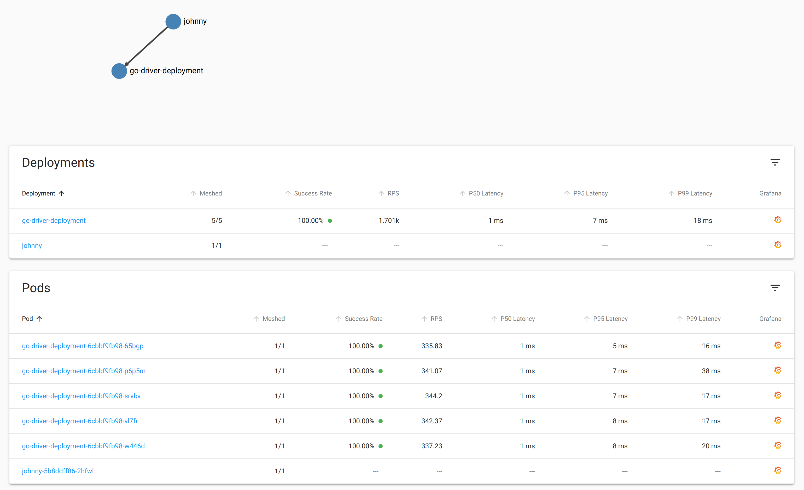

# bblfsh-driver-k8s
Example of running bblfsh drivers with gRPC LoadBalancer

## Summary
- There's a need to apply code parse using [bblfsh](https://github.com/bblfsh/sdk) drivers on the large scale
- Current [bblfshd](https://github.com/bblfsh/bblfshd) architecture does not allow us to achieve this goal

## Solution
Use k8s toolkit:
- group drivers into scalable deployments
- apply load-balancing
- [go-client](https://github.com/bblfsh/go-client): add ability to specify endpoints for each particular language([wip](https://github.com/bblfsh/go-client/pull/130))

## Roadmap
- deployment generation for different languages, include template to [bblfsh/sdk](https://github.com/bblfsh/sdk) maybe 
- if autoscaling is applied one day we need to consider using [this](https://linkerd.io/2/features/proxy-injection) approach

## Requirements
- [minikube](https://github.com/kubernetes/minikube) or higher `v1.5.2`
- [CoreDNS](https://github.com/coredns/deployment)
- [linkered](https://linkerd.io/2/getting-started)
- go `1.13` or higher

## Steps
### Run k8s cluster using minikube
I was testing it locally so `--vm-driver=none`
```bash
sudo minikube start --vm-driver=none
```
Optionally you can create the dashboard
```bash
sudo minikube dashboard
```
This command's output will give you a corresponding URL to the dashboard
```bash
🤔  Verifying dashboard health ...
🚀  Launching proxy ...
🤔  Verifying proxy health ...
http://127.0.0.1:43397/api/v1/namespaces/kubernetes-dashboard/services/http:kubernetes-dashboard:/proxy/
```
### Download and deploy CoreDNS
```bash
git clone https://github.com/coredns/deployment.git
cd deployment/kubernetes/
./deploy.sh | kubectl apply -f -
```
### Deploy Namespace, Service and Deployment for a bunch of go-drivers
Deployment contains several replicas of go-driver containers

From the root folder:
```bash
kubectl create -f configs/service.yml
kubectl create -f configs/deployment.yml
```
### Prepare and deploy client
Client is a simple go-driver gRPC client that bombs a given endpoint with simple parse requests

Firstly, let's build an image
```bash
cd client/
./build.sh
```
Now let's deploy an image

From the root folder:
```bash
kubectl create -f configs/client.yml
```
### Install and deploy linkerd
We use [linkerd](https://linkerd.io) as a client-side gRPC load-balancer.
Some of steps are taken and changed from the [Getting Started](https://linkerd.io/2/getting-started) guide, please navigate there for steps explanation.

Install linkered:
```bash
curl -sL https://run.linkerd.io/install | sh
```
Optionally add it to `PATH`:
```bash
export PATH=$PATH:$HOME/.linkerd2/bin
```
Deploy linkered to k8s:
```bash
linkerd install | kubectl apply -f -
```
**Note:** some proxy start issues may appear, to avoid them **DO NOT** run pre-installation check `linkerd check --pre`

Check the installation status:
```bash
linkerd check
```
This may take a while, here's the example of successful output:
```bash
kubernetes-api
--------------
√ can initialize the client
√ can query the Kubernetes API

kubernetes-version
------------------
√ is running the minimum Kubernetes API version
√ is running the minimum kubectl version

linkerd-config
--------------
√ control plane Namespace exists
√ control plane ClusterRoles exist
√ control plane ClusterRoleBindings exist
√ control plane ServiceAccounts exist
√ control plane CustomResourceDefinitions exist
√ control plane MutatingWebhookConfigurations exist
√ control plane ValidatingWebhookConfigurations exist
√ control plane PodSecurityPolicies exist

linkerd-existence
-----------------
√ 'linkerd-config' config map exists
√ heartbeat ServiceAccount exist
√ control plane replica sets are ready
√ no unschedulable pods
√ controller pod is running
√ can initialize the client
√ can query the control plane API

linkerd-api
-----------
√ control plane pods are ready
√ control plane self-check
√ [kubernetes] control plane can talk to Kubernetes
√ [prometheus] control plane can talk to Prometheus
√ no invalid service profiles

linkerd-version
---------------
√ can determine the latest version
√ cli is up-to-date

control-plane-version
---------------------
√ control plane is up-to-date
√ control plane and cli versions match

Status check results are √
```
### Inject linkerd to existing deployments
This command retrieves all of the deployments running in the `go-driver` namespace, runs the manifest through linkerd inject, and then reapplies it to the cluster. The linkerd inject command adds annotations to the pod spec instructing Linkerd to add (“inject”) the data plane’s proxy is added as a container to the pod spec.
```bash
kubectl get -n go-driver deploy -o yaml \
  | linkerd inject - \
  | kubectl apply -f -
```
### Check the result
Firstly, let's create linkered dashboard
```bash
linkerd dashboard
```
Then choose our namespace `go-driver`:

As we can see the load is spread between all existing pods.

Additionally, there're links to Grafana to monitor metrics more precisely if needed.
